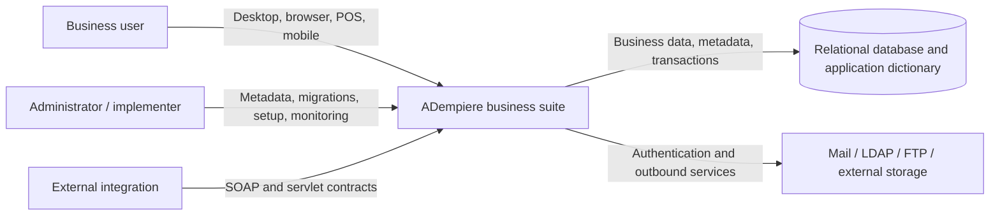
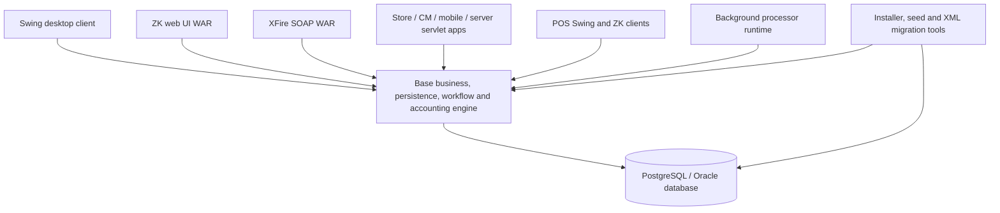
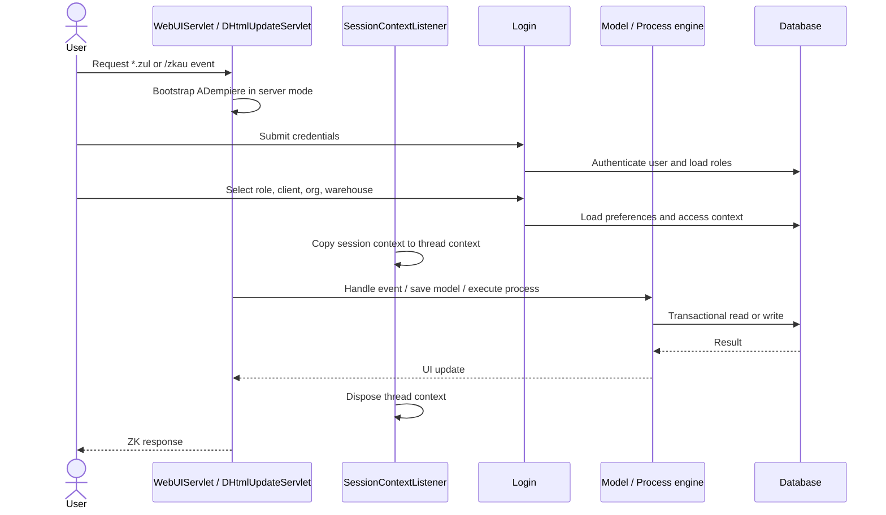
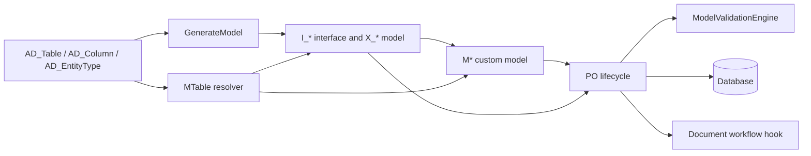
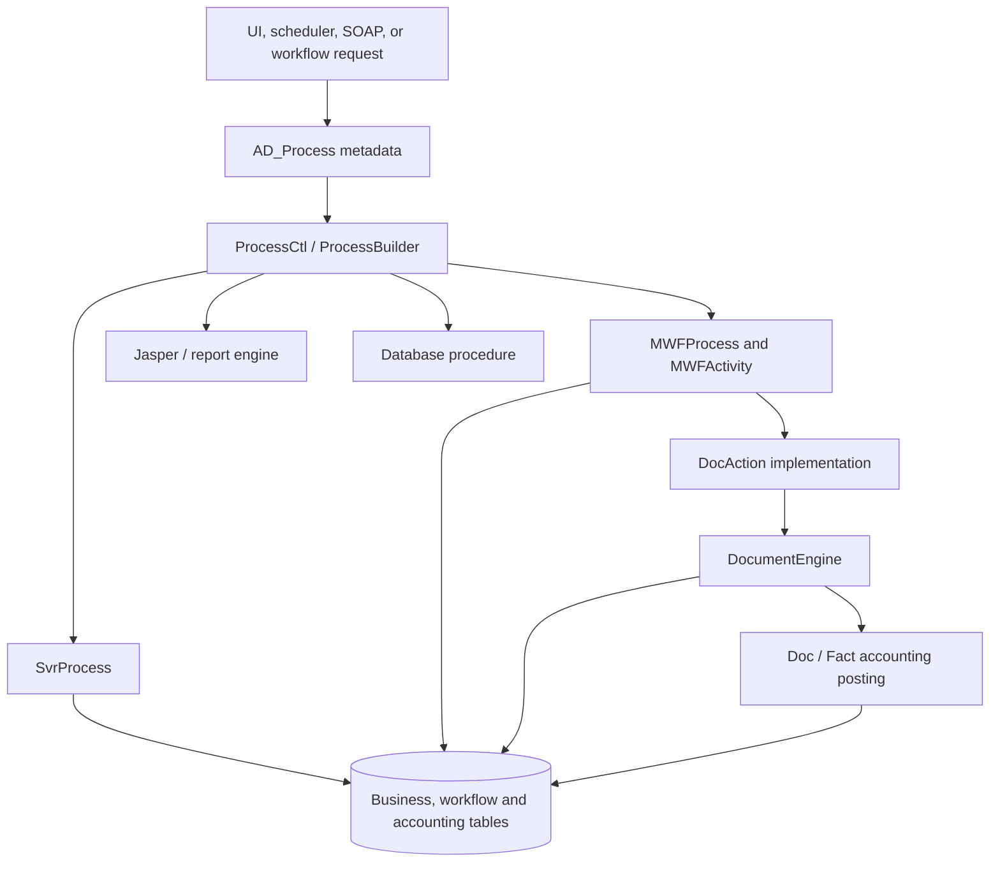
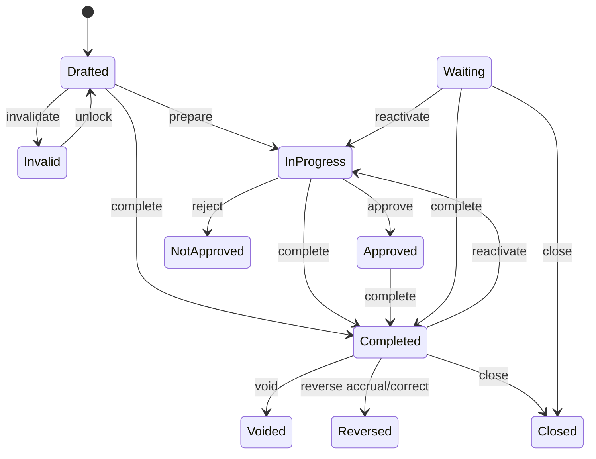
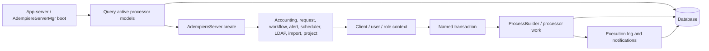

# ADempiere Architecture

> **Snapshot described:** `develop` at
> `59557cc2ee85ac938cd4f31a246d891bc2b15b8f` (2023-12-11).
>
> This document is local-first: claims are grounded in this checkout. `[INFERRED]`
> marks a conclusion drawn from code or configuration rather than an explicit
> statement. `[UNVERIFIED]` marks a fact that cannot be established from the
> checkout alone or a command that was not demonstrated successfully.

## Part 1 - Whole-repository technical deep-dive

### What this repository is

ADempiere is a Java-based open-source business suite spanning ERP, CRM,
manufacturing, supply-chain management, and point-of-sale capabilities
(`README.md#L25-L27`). This repository is not only an application source tree:
it also contains the desktop and web clients, metadata-driven business engine,
background processors, SOAP and servlet applications, database seeds and
migrations, installer construction, release packaging, and a large checked-in
runtime library set.

At this snapshot, a local checkout inventory found 5,426 Java files, 27 Scala
files, 978 XML migration files, 122 Java test files, 8 Scala test files, and 406
tracked JAR files. The scale and the overlap between Ant, Gradle, and sbt are
important architectural facts: there is no single build graph that represents
every deployable surface.

### Technology detection

| Layer | Technology | Evidence |
|---|---|---|
| Primary language/runtime | JDK 21 across Gradle and the Phase 3-owned Ant/Javadoc/XMLBeans build surfaces | CI and runtime templates select JDK 21; Gradle emits class-file major 65 and `verifyPhase3AntJavaLevel` rejects reintroduced Java 11 pins (`.github/workflows/main.yml`, `build.gradle`, `gradle/phase3/distribution.gradle`). |
| Secondary language | Scala, with three incompatible version lines: 3.2.1, 2.13.6, and 2.11.8 | Root and module sbt definitions (`build.sbt#L15-L22`, `org.adempiere.test/build.sbt#L15-L21`, `org.adempiere.pos/build.sbt#L1-L9`). |
| Primary full-product build | Apache Ant, orchestrated by guarded Phase 3 Gradle lifecycle tasks | The root build delegates to the 32-entry Ant reactor; `gradle/phase3/topology.tsv` reconciles it with the 28-project Gradle graph (`build.xml`, `utils_dev/build.xml`, `gradle/phase3/distribution.gradle`). |
| Library/module build | Gradle 8.10.2 wrapper on JDK 21, publishing Java 21 bytecode | Root Gradle convention, committed dependency locks/verification, and 28 unique included projects (`build.gradle`, `settings.gradle`, `gradle/phase1/gradle-projects.txt`). |
| Experimental web/test build | sbt 1.6.2 with sbt-web, Tomcat, Jetty, assembly, and dotenv plugins | `project/build.properties#L1`, `project/plugins.sbt#L1-L6`, `build.sbt#L18-L178`. |
| Desktop UI | Java Swing | The desktop main class launches `org.compiere.apps.AMenu` (`client/src/org/adempiere/Adempiere.java#L647-L675`). |
| Primary web UI | ZK 3.6.3 on Servlet 2.4-era descriptors | ZK and custom servlet mappings are in `zkwebui/WEB-INF/web.xml#L1-L75`; 3.6.3 is recorded in the tracked ZK JAR manifests. |
| API | SOAP/RPC through Codehaus XFire | XFire servlet routes and four service beans (`org.adempiere.webservice/WEB-INF/web.xml#L8-L38`, `org.adempiere.webservice/WEB-INF/src/META-INF/xfire/services.xml#L1-L45`). |
| Persistence | Metadata-driven Active Record over JDBC | `PO` controls persistence lifecycle; `MTable` maps dictionary metadata to model classes (`base/src/org/compiere/model/PO.java#L2101-L2394`, `base/src/org/compiere/model/MTable.java#L87-L300`). |
| Transactions | Named JDBC transactions and savepoints | `Trx` caches named transactions and creates non-auto-commit connections (`base/src/org/compiere/util/Trx.java#L57-L190`, `base/src/org/compiere/util/Trx.java#L262-L368`). |
| Database support | PostgreSQL and Oracle are first-class installation/seed targets; MySQL and MariaDB adapters remain in code | Installer selection and JDBC setup (`install/Adempiere/build.xml#L45-L90`, `base/src/org/compiere/db/CConnection.java#L840-L930`). |
| Workflow | Database-defined workflows, activities, and document state machines | `MWFActivity` and `DocumentEngine` (`base/src/org/compiere/wf/MWFActivity.java#L754-L1072`, `base/src/org/compiere/process/DocumentEngine.java#L268-L768`). |
| Reporting | JasperReports plus ADempiere report metadata | The client depends on the JasperReports module; workflow activities can create report PDFs (`client/build.gradle#L38-L48`, `base/src/org/compiere/wf/MWFActivity.java#L899-L947`). |
| Scheduling | cron4j-backed database-configured schedulers | Scheduler process construction and execution (`serverRoot/src/main/server/org/compiere/server/Scheduler.java#L85-L267`). |
| Logging | `java.util.logging`, ADempiere handlers, and Log4j bridging | `CLogger` and global logging setup (`base/src/org/compiere/util/CLogger.java#L40-L90`, `base/src/org/compiere/util/CLogMgt.java#L48-L169`). |
| Packaging | ZIP/TAR.GZ installer, seed archives, EAR/WAR/JAR outputs | Root and installer Ant targets (`build.xml#L25-L106`, `install/build.xml#L250-L364`). |

### Entry points and deployable applications

| Surface | Entry point | Lifecycle |
|---|---|---|
| Desktop client | `org.adempiere.Adempiere.main()` | Initializes logging, properties, database access, shared engines, and then launches `AMenu` (`client/src/org/adempiere/Adempiere.java#L415-L583`, `client/src/org/adempiere/Adempiere.java#L647-L675`). |
| ZK web client | `WebUIServlet` for `*.zul`/`*.zhtml`; ZK `DHtmlUpdateServlet` for `/zkau/*` | The servlet installs server context support and starts ADempiere in server mode before serving requests (`zkwebui/WEB-INF/web.xml#L27-L55`, `zkwebui/WEB-INF/src/org/adempiere/webui/session/WebUIServlet.java#L64-L88`). |
| Background server | `AdempiereServerMgr.main()` and the app-server startup path | Discovers active processor rows, creates worker threads, and manages their lifecycle (`serverRoot/src/main/server/org/compiere/server/AdempiereServerMgr.java#L52-L64`, `serverRoot/src/main/server/org/compiere/server/AdempiereServerMgr.java#L95-L192`). |
| SOAP API | XFire servlet under `/services/*` and `/servlet/XFireServlet/*` | Exposes `ADService`, `ModelADService`, `ExternalSales`, and `WebService` (`org.adempiere.webservice/WEB-INF/web.xml#L8-L38`, `org.adempiere.webservice/WEB-INF/src/META-INF/xfire/services.xml#L1-L45`). |
| Legacy server web app | Servlets including login, window, process, and report controllers | Routes are declared in `serverApps/src/web/WEB-INF/web.xml#L1-L65`. |
| Web store | Storefront servlets backed by `serverApps` implementations | `webStore/src/web/WEB-INF/web.xml#L1-L70`; login is implemented by `serverApps/src/main/servlet/org/compiere/wstore/LoginServlet.java#L40-L90`. |
| Web content management | Broadcast, redirect, community, and request servlets | `webCM/src/web/WEB-INF/web.xml#L1-L65`. |
| Mobile web client | `WLogin`, `WMenu`, `WWindow`, and `WProcess` servlets | `org.compiere.mobile/WEB-INF/web.xml#L1-L65`. |
| Point of sale | Swing `POSApplication` and ZK `WPOS` | `org.adempiere.pos/src/main/java/ui/swing/org/adempiere/pos/POSApplication.java#L30-L70`, `org.adempiere.pos/src/main/java/ui/zk/org/adempiere/pos/WPOS.java#L40-L110`. |
| Root/status web app | JNLP download, status, and monitor servlets | `serverRoot/src/web/WEB-INF/web.xml#L1-L65`. |
| Database migration CLI | `org.adempiere.process.MigrationLoader` | Boots the environment, imports ordered XML migrations, applies them transactionally, then synchronizes sequences, terminology, and access (`base/src/org/adempiere/process/MigrationLoader.java#L41-L139`). |

### Commands and verification inventory

The build systems overlap but are not equivalent. Ant is the release/distribution
reactor. Gradle builds and publishes a narrower set of modules. sbt is a
developer-oriented experimental path with machine-specific assumptions.

| Command | Purpose and status | Evidence |
|---|---|---|
| `./gradlew phase3NoDatabaseDistribution --dependency-verification=strict` | Canonical guarded full-product build, install, silent setup, topology check, and normalized artifact manifest without seed restore. | `gradle/phase3/distribution.gradle`, `.github/workflows/main.yml`. |
| `xvfb-run -a ./gradlew phase3InstalledProduct ... --dependency-verification=strict` | Full installed-product gate against marker-owned disposable PostgreSQL 14.6 and Tomcat 9, including the Phase 2 DB-backed smoke and final database/role cleanup. Context base paths require HTTP 2xx/3xx except the explicitly deployment-only `ADInterface` 404. | `gradle/phase3/distribution.gradle`, `scripts/phase3/`, `.github/workflows/main.yml`. |
| `ant build -Dnodbrestore=true` | Underlying authoritative Ant product build without database restore. The Phase 3 Gradle task supplies guarded installation paths and JDK 21. | `build.xml`, `gradle/phase3/distribution.gradle`. |
| `ant build -Dnodbrestore=false` | Underlying database-enabled Ant build. Run only through an approved disposable environment with explicit release scoping. | `build.xml`, `gradle/phase3/distribution.gradle`. |
| `./gradlew build --dependency-verification=strict` | Reproducible JDK 21 module gate across 28 included projects. It executes the core unit gate and publishes Java 21 bytecode. It does **not** build every Ant deployable. | `.github/workflows/build_with_gradle.yml`, `settings.gradle`, `docs/modernization/phase-1-evidence.md`. |
| `./gradlew publish --dependency-verification=strict` | Publishes Gradle artifacts to Maven Central staging during a published release using JDK 21. Release publication rejects previously used versions and declares JDK 21 as the minimum. | `.github/workflows/publish_with_gradle.yml`, `.github/workflows/build_with_gradle.yml`, `gradle/phase2/release-contract.properties`. |
| `./utils/RUN_Adempiere.sh` | Starts the desktop Swing client. | `utils/RUN_Adempiere.sh#L20-L42`. |
| `./utils/RUN_Server2.sh` | Starts the selected external WildFly, Tomcat, or Jetty server. | `utils/RUN_Server2.sh#L20-L85`. |
| `./utils/RUN_ImportAdempiere.sh` | Restores the selected PostgreSQL or Oracle seed database. Destructive/database-affecting; inspect environment first. | `utils/RUN_ImportAdempiere.sh#L1-L220`. |
| `./utils/RUN_MigrateXML.sh` | Applies XML migrations through `MigrationLoader`. Database-affecting. | `utils/RUN_MigrateXML.sh#L1-L94`, `base/src/org/adempiere/process/MigrationLoader.java#L41-L139`. |
| `ant -f tools/build.xml && ant -f base/build.xml unit-tests` | Builds the generated `lib/CCTools.jar` and related prerequisites, then runs the base Ant unit-test target. The complete reactor already builds `tools` before `base`; no single independently documented repository-wide test-only command was found. | Tool outputs, reactor order, and base test targets (`tools/build.xml#L515-L717`, `utils_dev/build.xml#L20-L22`, `base/build.xml#L180-L253`). |
| `ant -f base/build.xml integration-tests -Dtest.performIntegrationTests=true` | Enables and runs base integration tests against a configured environment. `[UNVERIFIED]` as a clean-checkout command because database/application properties are external. | `base/build.xml#L180-L253`, `utils_dev/test.properties#L16-L21`. |
| `gradle :base:test --tests '<fully.qualified.Test>'` | Conventional Gradle single-test selector, but **not canonical here**. `[UNVERIFIED]`: no repository-wide `useJUnitPlatform()` configuration was found although modules declare JUnit Jupiter APIs. | `base/build.gradle#L55-L73`; checkout-wide Gradle configuration scan. |
| `sbt test` | Experimental Scala/JVM test path. `[UNVERIFIED]` on a clean checkout because sbt files contain developer-specific absolute paths. | `build.sbt#L27-L40`, `org.adempiere.test/build.sbt#L18-L24`. |
| `sbt ~tomcat:start` / `sbt ~jetty:start` | Experimental local web-container path. Not a release-equivalent server command. | `build.sbt#L99-L178`. |
| Lint | No canonical repository-wide lint command or enforced lint workflow was found. | `[UNVERIFIED]` checkout scan of manifests, build targets, and workflows. |
| Format | No canonical repository-wide formatter command or formatting gate was found. | `[UNVERIFIED]` checkout scan. |
| Static typecheck | Java compilation is the effective typecheck; no separate static-analysis/typecheck command was found. | Ant/Gradle compile tasks (`utils_dev/build.xml#L111-L224`, `.github/workflows/build_with_gradle.yml#L25-L49`). |
| End-to-end/contract tests | No distinct automated end-to-end or API-contract gate was found. Integration tests are the nearest named class and are disabled by default. | `utils_dev/test.properties#L9-L21`. |

#### CI workflows and enforcement

| Workflow | Trigger | What it does |
|---|---|---|
| `main.yml` | Push and pull request to `master`, `develop`, and bugfix/feature/hotfix/test branch patterns | Runs the existing Ant lane on JDK 21 with PostgreSQL 14.6; path filtering decides whether to restore and migrate the database (`.github/workflows/main.yml`). |
| `build_with_gradle.yml` | Same push and pull-request branch families | Runs the reproducible Gradle gate, internal-API checks, Tomcat bridge probe, and a separate PostgreSQL 14.6/Xvfb runtime-smoke job on JDK 21 (`.github/workflows/build_with_gradle.yml`). |
| `release.yml` | Published GitHub release | Runs the database-enabled Ant build and uploads installers and seed artifacts (`.github/workflows/release.yml#L1-L77`). |
| `publish_with_gradle.yml` | Published GitHub release | Runs `gradle publish` with Maven Central credentials (`.github/workflows/publish_with_gradle.yml#L1-L38`). |
| `auto-assign-pull-requests.yml` | Pull request opened | Adds the `09 Pending Peer Review` label (`.github/workflows/auto-assign-pull-requests.yml#L1-L33`). |
| `issue-and-pr-translator.yml` | Issue, PR, comment, and discussion events | Runs an issue/PR translation action (`.github/workflows/issue-and-pr-translator.yml#L1-L22`). |

**CI enforcement is `[UNVERIFIED]`.** Workflow files prove that checks run, but
required status checks and branch protection are GitHub repository settings and
are not represented in the checkout. README badges likewise prove visibility,
not merge blocking (`README.md#L1-L10`).

### Directory and module layout

| Area | Purpose |
|---|---|
| `base/` | Core Active Record persistence, generated models, business models, accounting, process execution, workflow, validation, security utilities, and database adapters. |
| `client/` | Swing desktop shell, menus, windows, process dispatch, and shared client startup. |
| `zkwebui/` | Primary ZK browser UI, login/session handling, dynamic desktop, and web resources. |
| `serverRoot/` | Background processor manager, scheduler and server workers, root web status/monitor/JNLP application. |
| `serverApps/` | Shared servlet implementations for the legacy web applications. |
| `org.adempiere.webservice/` | XFire SOAP services and RPC implementation. |
| `webStore/`, `webCM/`, `org.compiere.mobile/` | Legacy storefront, content-management, and mobile servlet applications. |
| `org.adempiere.pos/` | Swing and ZK point-of-sale applications. |
| `org.adempiere.*`, `org.eevolution.*`, `org.spin.*` | Domain and platform extensions, including production, manufacturing, request, project, human resources, authentication, and reporting modules. |
| `db/ddlutils/` | Portable schema/data definitions and database-specific DDL generation/import support. |
| `data/seed/` | Compressed Oracle and PostgreSQL seed databases used by installation and CI. |
| `migration/` | Ordered XML application-dictionary and schema migrations, grouped by release transition. |
| `install/` | Installer assembly, environment templates, app-server data-source setup, and release archives. |
| `utils/` | Runtime, setup, database import/export/migration, client, and server scripts. |
| `utils_dev/` | Full Ant reactor, shared build/test properties, deployment, setup, and packaging orchestration. |
| `tools/` | Build tools and the checked-in runtime/compile JAR collection. |
| `.github/` | CI/release workflows and the composite Ant build action. |

The Ant `jar` reactor enumerates 32 build directories, including deployable web
applications and database components; the separate `build` target also invokes
the installer (`utils_dev/build.xml#L20-L58`). Gradle has 29 include
declarations but only 28 unique projects because `org.spin.authentication`
appears twice (`settings.gradle#L3-L31`).

**[Resolved contradiction] Ant and Gradle do not mean the same thing by
"build."** Gradle omits important Ant deployables, including `zkwebui`,
`org.adempiere.webservice`, `webStore`, `webCM`, `serverApps`, the mobile app,
and SQLJ. Therefore `gradle build` is a library/module validation and publication
path; `ant build` is the product distribution path.

Phase 3 makes that asymmetry executable rather than implicit:
`gradle/phase3/topology.tsv` classifies all 32 Ant reactor entries, the separate
installer and embedded surfaces, all 28 Gradle projects, and the JBoss facet
quarantine. The installed Tomcat 9 bridge deploys seven WARs. DB-backed metadata
validation checks active process, validator, workflow/reference, entity, and
generated-model bindings; 16 pre-existing active process bindings are an
explicit fail-on-drift quarantine in `gradle/phase3/metadata-quarantine.tsv`.

### Deployment and runtime surface

| Surface | Pin or selection | Evidence and implication |
|---|---|---|
| CI Java | Temurin 21 | Ant, Gradle, and release workflows install Java 21 (`.github/workflows/main.yml`, `.github/workflows/build_with_gradle.yml`, `.github/workflows/release.yml`). |
| Installer Java | JDK 21 runtime and bytecode | The environment template selects JDK 21 and Phase 3 rejects Java 11 carry-over pins (`install/Adempiere/AdempiereEnvTemplate.properties`, `gradle/phase3/distribution.gradle`). |
| CI database | PostgreSQL 14.6 | Service container in Ant and release workflows (`.github/workflows/main.yml#L22-L38`, `.github/workflows/release.yml#L18-L31`). |
| CI application server | Tomcat 9.0.121 | Checksum-verified and exercised with the installed seven-WAR product (`gradle/phase2/runtime.properties`, `scripts/phase3/prepare-tomcat9.sh`, `scripts/phase3/smoke-tomcat9.sh`). |
| Installed application server | External Tomcat by default, under `/opt/tomcat`; WildFly and Jetty are selectable | `install/Adempiere/AdempiereEnvTemplate.properties#L28-L38`, `utils/RUN_Server2.sh#L20-L85`. No runtime version is pinned by the environment template. |
| Experimental sbt servers | Tomcat/webapp-runner 9.0.41.0 and Jetty 10.0.12 | `build.sbt#L99-L178`. |
| Product version | 3.9.4 / `394LTS`; environment template release `3.9.4` | `utils_dev/build.properties#L5-L6`, `install/Adempiere/AdempiereEnvTemplate.properties#L74-L76`. |
| Database drivers | Runtime JARs under `tools/lib`; database selection in installer | `install/Adempiere/build.xml#L45-L90`, `install/Adempiere/build.xml#L520-L590`. |
| Deployment packaging | EAR/WAR/JAR plus installer ZIP/TAR.GZ | `utils_dev/build.xml#L111-L224`, `install/build.xml#L250-L364`. |
| Containers | No Dockerfile, Containerfile, or Compose deployment was found | Checkout scan; the PostgreSQL CI service is the only containerized runtime visible locally. |

**[Resolved contradiction] Runtime server versions drift by path.** CI uses
Tomcat 9.0.121, the sbt path pins Tomcat 9.0.41.0 and Jetty 10.0.12, while
installation scripts accept externally installed Tomcat/WildFly/Jetty without
pinning their versions. A build can therefore pass against one container version
and run against another (`.github/workflows/main.yml#L52-L68`,
`build.sbt#L99-L178`, `utils/RUN_Server2.sh#L20-L85`).

**[Resolved contradiction] Dependency declarations are not necessarily runtime
truth.** Ant often consumes checked-in JARs while Gradle resolves declared
versions. Examples found locally include PostgreSQL 42.3.3 in Gradle versus a
42.5.1 bundled JAR, MariaDB 3.0.4 in Gradle versus 1.4.6 bundled, and cron4j
2.2.5 in Gradle versus 2.2.1 in the Ant/runtime path
(`base/build.gradle#L50-L73`, `base/build.xml#L50-L90`). The 406 tracked JARs
make this a supply-chain and reproducibility concern, not a cosmetic mismatch.

### EOL and dead-dependency scan

These findings are risk flags, not upgrade prescriptions. Upstream support
status was not fetched; classifications are based on age, API generation, and
local version evidence.

| Component | Local evidence | Assessment |
|---|---|---|
| ZK 3.6.3 | Tracked ZK JAR manifests and Servlet 2.4 web descriptor (`zkwebui/WEB-INF/web.xml#L1-L75`) | `[INFERRED]` Very old and likely outside maintained support. A replacement or major upgrade would affect every ZUL event/controller surface. |
| XFire 1.2.6 SOAP stack | XFire servlet and service descriptors (`org.adempiere.webservice/WEB-INF/web.xml#L8-L38`, `org.adempiere.webservice/WEB-INF/src/META-INF/xfire/services.xml#L1-L45`) | `[INFERRED]` Retired framework generation. Treat SOAP contracts as compatibility seams before replacement. |
| Java EE 5 / `javax.*` generation | Java EE 5 dependency declarations and Servlet 2.3/2.4 descriptors (`base/build.gradle#L46-L47`, `zkwebui/WEB-INF/web.xml#L1-L15`) | `[INFERRED]` A move to modern Jakarta containers entails namespace and descriptor migration, not only a JVM bump. |
| ActiveMQ 5.7.0 | Dependency declaration in the base module (`base/build.gradle#L55-L73`) | `[INFERRED]` Old broker client generation; verify live use before upgrading or removing. |
| Log4j 1.2 compatibility/declarations | Base dependency set and logging bridge (`base/build.gradle#L55-L73`, `base/src/org/compiere/util/CLogMgt.java#L48-L169`) | `[INFERRED]` Multiple logging generations complicate security patching and runtime behavior. |
| MySQL Connector/J 5.1.x | Gradle and Ant/runtime declarations (`base/build.gradle#L55-L73`, `base/build.xml#L50-L90`) | `[INFERRED]` Legacy driver line. |
| MariaDB JDBC 1.4.6 bundled runtime | Checked-in runtime JAR versus newer Gradle declaration (`base/build.gradle#L55-L73`, `base/build.xml#L50-L90`) | `[INFERRED]` Build/runtime version split needs resolution before database compatibility claims. |
| Apache POI 3.17 | Module dependency declarations (`base/build.gradle#L55-L73`) | `[INFERRED]` Legacy document-processing generation. |
| Groovy 2.4.15 | Root sbt dependency configuration (`build.sbt#L45-L70`) | `[INFERRED]` Old scripting runtime embedded in an already non-portable build path. |
| cron4j 2.2.x | Base dependency plus scheduler implementation (`base/build.gradle#L55-L73`, `serverRoot/src/main/server/org/compiere/server/Scheduler.java#L85-L267`) | `[INFERRED]` Small, old scheduling dependency at the center of background automation. |
| GitHub Actions v1/v3 and mutable release action | Workflow action pins (`.github/workflows/main.yml#L39-L79`, `.github/workflows/release.yml#L32-L77`) | `[INFERRED]` Several action generations are obsolete or mutable. CI may fail independently of product code. |
| Checked-in binary dependency estate | 406 tracked JARs; Ant consumes `tools/lib` | `[INFERRED]` No single lockfile/SBOM defines the effective runtime. Provenance, CVE scanning, and coordinated upgrades are difficult. |

### Data and storage

The relational database is both the transactional data store and the application
configuration/control plane. It stores:

- business records represented by generated `X_*` and hand-written `M*` model
  classes;
- application dictionary metadata such as tables, columns, windows, tabs,
  fields, processes, workflows, validators, roles, and system configuration;
- process instances and output;
- scheduler and background processor definitions;
- migration state and steps.

`MTable` resolves an `AD_Table` row to a generated or custom Java model class
using entity-type package information and naming conventions
(`base/src/org/compiere/model/MTable.java#L87-L300`,
`base/src/org/compiere/model/MTable.java#L538-L660`). The generated-model
directory contains 922 `I_*` interfaces and 922 `X_*` Active Record classes at
this snapshot. `GenerateModel` queries active `AD_Table` rows, filters by entity
type/table name, and emits both interfaces and implementations
(`base/src/org/adempiere/util/GenerateModel.java#L62-L168`).

`PO.save()` enforces organization/client access-level rules, creates or joins a
named transaction, establishes a savepoint, runs `beforeSave`, invokes model
validators, writes the record, and commits or rolls back
(`base/src/org/compiere/model/PO.java#L2101-L2288`). Successful persistence then
runs `afterSave`, after-event validators, and document workflow hooks
(`base/src/org/compiere/model/PO.java#L2320-L2394`).

Database evolution is represented as ordered XML. `MigrationLoader` defaults to
`$ADEMPIERE_HOME/migration`, executes `MigrationFromXML`, then sequence,
terminology, and role-access synchronization
(`base/src/org/adempiere/process/MigrationLoader.java#L41-L139`).
`MigrationFromXML` recursively sorts XML files, creates one transaction per
migration, skips already-applied entries, retries failed/partial entries through
rollback, and applies steps through the configured process
(`base/src/org/compiere/process/MigrationFromXML.java#L35-L180`). Individual
migrations can contain database-specific steps, as shown by separate PostgreSQL
and Oracle operations (`migration/394lts-3.9.4.001/09970_Fix_Production_Line_constraint.xml#L3-L10`).

### APIs and integration surfaces

- **SOAP API:** Four XFire services provide model, process, login, and external
  sales operations. Preserve their WSDL/wire behavior before replacing the
  framework (`org.adempiere.webservice/WEB-INF/src/META-INF/xfire/services.xml#L1-L45`,
  `org.adempiere.webservice/WEB-INF/src/com/_3e/ADInterface/ADServiceImpl.java#L100-L140`).
- **Servlet applications:** ZK, server apps, web store, web CM, mobile, and root
  monitor applications are separately described and packaged. They share the
  core model/process engine but have distinct URL contracts.
- **Database procedure/report execution:** `ProcessCtl` can dispatch a process
  to a workflow, reflected Java class, database procedure, Jasper report, or
  report view based on `AD_Process` metadata
  (`client/src/org/compiere/apps/ProcessCtl.java#L281-L420`,
  `client/src/org/compiere/apps/ProcessCtl.java#L540-L600`).
- **Email, LDAP, FTP and external storage:** These are configured through
  environment/system/client metadata and consumed by background processors and
  business services. They are integration points rather than separate bounded
  services.
- **Replication/import:** Dedicated processor model types are discovered and
  started by the server manager
  (`serverRoot/src/main/server/org/compiere/server/AdempiereServerMgr.java#L95-L192`).

No modern REST controller layer, OpenAPI contract, message-bus service boundary,
or container-native deployment surface was found in the checkout.

### Plugins and extension mechanisms

ADempiere's primary extension system is metadata plus reflection rather than an
isolated plugin ABI:

1. `AD_EntityType` and `AD_Table` associate metadata with module/package
   conventions.
2. `MTable` resolves metadata to generated or custom `PO` implementations
   (`base/src/org/compiere/model/MTable.java#L87-L300`).
3. `AD_ModelValidator` supplies validator class names; the validation engine
   instantiates them and can also run JSR-223 script hooks
   (`base/src/org/compiere/model/ModelValidationEngine.java#L79-L177`,
   `base/src/org/compiere/model/ModelValidationEngine.java#L213-L360`).
4. `AD_Process` supplies process class, workflow, report, or procedure metadata;
   dispatch uses reflection or the corresponding engine
   (`client/src/org/compiere/apps/ProcessCtl.java#L281-L420`,
   `client/src/org/compiere/apps/ProcessCtl.java#L540-L600`).
5. `AD_SysConfig` is a cached database-backed switch/configuration mechanism
   used for optional behavior and implementation selection
   (`base/src/org/compiere/model/MSysConfig.java#L69-L325`).
6. Gradle/Ant modules package domain-specific code, but their inclusion lists
   are manual and differ by build system (`settings.gradle#L3-L31`,
   `utils_dev/build.xml#L20-L54`).

This design makes extensions powerful, but dependency validity is frequently
checked only at runtime: a class name, metadata ID, process definition, or
package convention can be wrong while Java compilation remains green.

### Background jobs

`AdempiereServerMgr` queries the database for active accounting, request,
workflow, alert, scheduler, LDAP, replication/import, and project processors and
starts one server thread per configured model
(`serverRoot/src/main/server/org/compiere/server/AdempiereServerMgr.java#L95-L192`).
`AdempiereServer.create()` maps each processor model type to its concrete worker
class (`serverRoot/src/main/server/org/compiere/server/AdempiereServer.java#L49-L78`).
The worker base loop calculates sleep time, performs work, and records execution
state (`serverRoot/src/main/server/org/compiere/server/AdempiereServer.java#L220-L316`).

Schedulers create a client/user/role context, open a named transaction, invoke
the `AD_Process` through `ProcessBuilder`, and queue notifications
(`serverRoot/src/main/server/org/compiere/server/Scheduler.java#L85-L267`,
`serverRoot/src/main/server/org/compiere/server/Scheduler.java#L386-L410`).
Because schedules and workers are database-configured, deployment health depends
on both code and metadata compatibility.

### Testing model

- Global Ant defaults enable testing and unit tests but disable integration
  tests (`utils_dev/test.properties#L9-L21`).
- Module Ant builds use JUnit Platform's `junitlauncher` and separate unit and
  integration tests with tags (`base/build.xml#L180-L253`).
- Full module `dist` targets commonly depend on integration-test targets, but
  with the default property an integration-test target becomes a no-op.
- Gradle modules declare JUnit Jupiter APIs, but no checkout-wide
  `useJUnitPlatform()` call was found. Therefore actual Jupiter execution under
  `gradle build` is `[UNVERIFIED]`, even when test compilation succeeds
  (`base/build.gradle#L55-L73`).
- sbt test configurations are not portable: the root and module builds contain
  developer-home absolute paths (`build.sbt#L27-L40`,
  `org.adempiere.test/build.sbt#L18-L24`,
  `org.adempiere.pos/build.sbt#L1-L24`).
- Integration tests require a real ADempiere database and environment. CI only
  restores/migrates that database on selected paths, making path-filter behavior
  part of the effective test policy (`.github/workflows/main.yml#L80-L112`).

## Part 2 - Checkout context and ecosystem

### Local checkout identity

| Property | Value | Evidence |
|---|---|---|
| Remote | `https://github.com/adempiere/adempiere.git` | Local `git remote -v` at documentation time. |
| Branch | `develop` | Local `git branch --show-current`. |
| HEAD | `59557cc2ee85ac938cd4f31a246d891bc2b15b8f` | Local `git log -1`; subject: `Merge branch 'master' into develop`. |
| Commit date | `2023-12-11T13:48:19-06:00` | Local `git log -1`. |
| Closest description | `3.9.4.001` | Local `git describe`; product properties report `3.9.4`/`394LTS` (`utils_dev/build.properties#L5-L6`). |
| Product | ADempiere ERP, CRM, MFG, SCM and POS | `README.md#L25-L27`. |
| Root license | GNU GPL version 2 | `LICENSE#L1-L4`. |

Some source files contain different or "version 2 or later" notices. The root
license establishes repository-level intent, but file-level notices should be
reviewed during redistribution or relicensing; this document does not make a
legal compatibility determination.

### Repository-specific guidance

- `README.md` is primarily a project introduction and CI-status surface; it does
  not provide a complete build or contribution guide (`README.md#L1-L27`).
- No root `CONTRIBUTING`, `AGENTS.md`, `CODEOWNERS`, or existing
  `ARCHITECTURE.md` was found in this checkout.
- The real operational rules are encoded in Ant/Gradle/sbt files and CI
  workflows rather than a contributor handbook.

### Developer gotchas

1. **Choose the build by intended artifact.** `gradle build` does not prove the
   ZK web UI, SOAP service, store, mobile, and other Ant-only deployments build.
   Use the Ant reactor for product/release confidence.
2. **There is no Gradle wrapper.** The installed Gradle version is ambient and
   can drift locally and on `ubuntu-latest`.
3. **Do not trust sbt on a fresh machine.** Three sbt builds use incompatible
   Scala versions and hard-coded developer paths (`build.sbt#L18-L40`,
   `org.adempiere.test/build.sbt#L15-L24`,
   `org.adempiere.pos/build.sbt#L1-L24`).
4. **Database compatibility is a startup concern.** Web login rejects a
   database whose `AD_System.Version` differs from the application
   (`zkwebui/WEB-INF/src/org/adempiere/webui/panel/LoginPanel.java#L470-L505`).
5. **Integration tests are off unless explicitly enabled.**
   `test.performIntegrationTests=false` is the default
   (`utils_dev/test.properties#L16-L21`).
6. **Metadata is executable configuration.** A code-only change may be
   incomplete without dictionary migrations, generated models, process/window
   metadata, role access, and terminology synchronization.
7. **Generated source is committed.** `GenerateModel` writes `I_*` and `X_*`
   classes from live dictionary metadata; its built-in default output path is a
   developer-specific absolute path, so pass directory/package/entity arguments
   explicitly (`base/src/org/adempiere/util/GenerateModel.java#L62-L168`).
8. **Dependency truth is split.** Gradle-resolved versions and Ant/runtime JARs
   can differ. Diagnose the actual packaging path before attributing runtime
   behavior to a manifest version.
9. **Runtime configuration includes credential placeholders.** The environment
   template must be replaced with deployment-specific values; defaults are not
   production secret management (`install/Adempiere/AdempiereEnvTemplate.properties#L7-L38`).
10. **The default branch model is ambiguous from disk.** Workflows target both
    `master` and `develop`; local configuration does not establish which branch
    is protected or release-authoritative (`.github/workflows/main.yml#L9-L20`).

### Broader ecosystem visible from disk

This checkout is a modular monolith and distribution repository, not one service
among separately versioned sibling repositories. Domain modules are packaged
independently for Gradle publication, but the Ant reactor assembles them into
one product distribution. Separately deployable web applications share the same
core, database, metadata model, and release train.

The strongest subsystem boundaries visible locally are:

- core business/persistence/workflow (`base`);
- desktop shell (`client`);
- browser shell (`zkwebui`);
- server workers (`serverRoot`);
- SOAP and servlet applications;
- domain extensions (`org.adempiere.*`, `org.eevolution.*`, `org.spin.*`);
- schema/seed/migration toolchain (`db`, `data`, `migration`);
- installer and app-server integration (`install`, `utils`, `utils_dev`).

These are packaging boundaries, not independently owned network-service
boundaries. Shared database metadata and direct Java project dependencies keep
their deployment cadence coupled.

## Part 3 - Architectural blueprint

### Stack summary

ADempiere is a metadata-driven JDK 21 modular monolith with multiple clients
and web applications over a shared relational database. Swing and ZK UIs,
servlets, SOAP endpoints, scheduled jobs, workflows, reports, and migration
tools all converge on the `base` model/process engine. Runtime behavior is
selected heavily from application-dictionary records and reflected class names,
while Ant constructs the authoritative product distribution.

### C4 level 1: system context

### C4 level 2: containers and deployables

The diagram shows logical containers. Depending on installation choices,
multiple WARs and workers can share an external Tomcat, WildFly, or Jetty
process (`utils/RUN_Server2.sh#L20-L85`).

### C4 level 3: representative ZK request lifecycle

Servlet routes are defined in `zkwebui/WEB-INF/web.xml#L27-L55`.
`WebUIServlet` starts the server environment
(`zkwebui/WEB-INF/src/org/adempiere/webui/session/WebUIServlet.java#L64-L88`).
Login authenticates credentials, roles, clients, and organizations
(`base/src/org/compiere/util/Login.java#L150-L430`), while role selection loads
preferences and completes the login
(`zkwebui/WEB-INF/src/org/adempiere/webui/panel/RolePanel.java#L330-L510`).
`SessionContextListener` copies the tenant/user/role properties into a
thread-local `ServerContext` for each ZK execution/event and disposes that
context afterward
(`zkwebui/WEB-INF/src/org/adempiere/webui/session/SessionContextListener.java#L53-L260`).

### Layering and dependency rules

| Direction | Rule | Enforcement |
|---|---|---|
| Clients/web/server -> base | UI and runtime shells call shared model, process, workflow, report, and utility APIs. | Gradle/Ant project dependencies, e.g. `client` exposes `base` (`client/build.gradle#L38-L48`). |
| Extensions -> base/client APIs | Domain modules add model/process/UI behavior against common APIs. | Module build dependencies and metadata package conventions. |
| Generated `X_*` -> `PO` | Every generated table model derives from the common persistence lifecycle. | Code generation, e.g. `X_AD_Migration extends PO` (`base/src/org/adempiere/core/domains/models/X_AD_Migration.java#L29-L44`). |
| Hand-written `M*` -> generated `X_*` | Business behavior wraps generated column accessors. | Naming convention and inheritance; not a static architecture gate. |
| Processes -> `SvrProcess`/`ProcessCtl` | Server processes use a common parameter/transaction lifecycle; client dispatch is selected by metadata. | Base classes plus reflected `AD_Process.Classname` (`client/src/org/compiere/apps/ProcessCtl.java#L281-L420`, `client/src/org/compiere/apps/ProcessCtl.java#L540-L600`). |
| Workflow -> models/processes/documents | Workflow nodes can execute document actions, reports, processes, email, variable changes, or user interaction. | Runtime action selection in `MWFActivity` (`base/src/org/compiere/wf/MWFActivity.java#L823-L1072`). |
| Everything -> shared database metadata | UI, security, process dispatch, workflow, scheduling, and extensions are database-configured. | Runtime lookups; there is no compile-time validator for the complete metadata graph. |

**[INFERRED] Layering is conventional, not strongly enforced.** Project
dependencies capture a broad direction, but reflection, shared utility access,
static context, generated source, and direct database metadata create paths the
compiler cannot validate. No ArchUnit, module-system, or equivalent dependency
rule test was found.

### Cross-cutting concerns

| Concern | Implementation and location | Assessment |
|---|---|---|
| Authentication | `Login` validates salted/hash credentials and can use LDAP or database encryption; web login also supports browser tokens (`base/src/org/compiere/util/Login.java#L150-L250`, `zkwebui/WEB-INF/src/org/adempiere/webui/panel/LoginPanel.java#L470-L540`). | Central but coupled to database/session context. |
| Authorization and tenancy | Role, client, organization, warehouse, and user IDs are loaded into shared `Properties`; `MRole` applies table/UI/report/export access. Web requests transfer these values to thread context (`base/src/org/compiere/util/Login.java#L260-L600`, `zkwebui/WEB-INF/src/org/adempiere/webui/session/SessionContextListener.java#L53-L260`). | Tenant isolation depends on correct context propagation. |
| Configuration | Environment properties configure installation/runtime; `MSysConfig` provides cached database configuration (`install/Adempiere/AdempiereEnvTemplate.properties#L3-L76`, `base/src/org/compiere/model/MSysConfig.java#L69-L325`). | Split between files and database metadata. |
| Feature flags | No dedicated flag service; `MSysConfig` conditionals and metadata activation fields serve this role. | `[INFERRED]` Flags are not centrally governed or typed. |
| Logging | `CLogger` extends Java logging; `CLogMgt` installs console, file, and error-buffer handlers and bridges Log4j (`base/src/org/compiere/util/CLogger.java#L40-L90`, `base/src/org/compiere/util/CLogMgt.java#L48-L169`). | Mature local logging, but dependency generations are mixed. |
| Metrics/tracing | Status/monitor servlets and processor execution rows are visible; no OpenTelemetry or modern metrics framework was found (`serverRoot/src/web/WEB-INF/web.xml#L1-L65`). | `[UNVERIFIED]` Operational insight is primarily logs, database state, and monitor pages. |
| Secrets | Database/app-server credentials are generated into environment properties; `SecureEngine` supports pluggable encryption (`install/Adempiere/AdempiereEnvTemplate.properties#L7-L38`, `base/src/org/compiere/util/SecureEngine.java#L40-L90`). | Templates contain placeholders/defaults, not a secret-store integration. |
| Error handling | Typed `AdempiereException`/`DBException`, process summaries, logger error buffers, transaction rollback, and `saveEx()` exceptions are the main mechanisms (`base/src/org/compiere/model/PO.java#L2250-L2318`). | Error propagation differs between boolean-returning legacy APIs and exception APIs. |
| Transactions | Named `Trx` instances, explicit savepoints, and automatic process transaction wrappers (`base/src/org/compiere/util/Trx.java#L57-L190`, `base/src/org/compiere/process/SvrProcess.java#L112-L201`). | Powerful but transaction names and thread context must be propagated correctly. |
| Internationalization | Messages, element metadata, translations, language context, and terminology synchronization reside in the database/application dictionary (`zkwebui/WEB-INF/src/org/adempiere/webui/panel/LoginPanel.java#L450-L505`, `base/src/org/adempiere/process/MigrationLoader.java#L90-L139`). | Schema/metadata changes often require translation synchronization. |

### Inferred architectural decisions

#### ADR: Treat the application dictionary as executable architecture

- **Context:** Business tables, windows, fields, access, processes, workflows,
  validators, schedulers, and configuration must be customizable without
  rebuilding every client.
- **Decision:** Store definitions in relational metadata and resolve Java
  behavior through IDs, naming conventions, and reflected class names.
- **Evidence:** `MTable`, `ModelValidationEngine`, and `ProcessCtl`
  (`base/src/org/compiere/model/MTable.java#L87-L300`,
  `base/src/org/compiere/model/ModelValidationEngine.java#L79-L177`,
  `client/src/org/compiere/apps/ProcessCtl.java#L281-L420`).
- **Consequences:** High implementation flexibility and shared behavior across
  clients; runtime-only failure modes, difficult static analysis, and tight
  coupling to database metadata.

#### ADR: Share one business engine across many presentation surfaces

- **Context:** Desktop, browser, POS, mobile, storefront, SOAP, reports, and jobs
  must apply the same business rules.
- **Decision:** Put persistence, validation, document, workflow, accounting, and
  process logic in `base`, with presentation/deployment modules depending on it.
- **Evidence:** Module dependency and entry-point topology
  (`client/build.gradle#L38-L48`, `settings.gradle#L3-L31`).
- **Consequences:** Consistent domain logic and fewer network boundaries; broad
  in-process coupling and a large blast radius for base-layer changes.

#### ADR: Use explicit document and workflow state machines

- **Context:** ERP documents need audited prepare, approve, complete, void,
  reverse, close, reactivate, and posting transitions.
- **Decision:** Standardize document behavior through `DocAction` and
  `DocumentEngine`, then orchestrate it through metadata-defined workflows.
- **Evidence:** `DocumentEngine` and `MWFActivity`
  (`base/src/org/compiere/process/DocumentEngine.java#L268-L768`,
  `base/src/org/compiere/wf/MWFActivity.java#L754-L1072`).
- **Consequences:** Reusable lifecycle semantics; complex interactions between
  document status, workflow state, transaction rollback, and accounting posting.

#### ADR: Make Ant the complete distribution reactor

- **Context:** The release includes many JARs, WARs, EAR/server artifacts,
  database seeds, installer resources, setup, and deployment steps.
- **Decision:** Manually enumerate all product components in the Ant reactor and
  use it for release packaging.
- **Evidence:** `utils_dev/build.xml#L20-L54`,
  `utils_dev/build.xml#L111-L224`, `install/build.xml#L250-L364`.
- **Consequences:** Complete release assembly; manual topology maintenance and
  divergence from Gradle/sbt graphs.

### Governance and enforcement

| Mechanism | What it enforces | Gap |
|---|---|---|
| Ant and Gradle CI | Compilation/build checks on pushes and PRs | Required-check status is `[UNVERIFIED]`; Gradle does not cover the full product. |
| Path-filtered Ant database restore | Restores/migrates the database when migrations or build-sensitive files change | Correctness depends on the path list remaining complete (`.github/workflows/main.yml#L80-L112`). |
| Generated model pattern | Aligns Java accessors with dictionary tables | No checked-in generation-diff CI gate was found. |
| XML migration status | Orders, applies, retries, and records database changes | Requires a compatible running database and metadata; integration tests are disabled by default. |
| `AD_System.Version` login check | Rejects application/database version mismatch | Detects version drift at login rather than during packaging (`zkwebui/WEB-INF/src/org/adempiere/webui/panel/LoginPanel.java#L470-L505`). |
| Process/workflow base classes | Standardizes transactions, parameters, output, and state | Metadata can still reference missing or incompatible classes. |
| PR auto-label | Marks opened PRs pending peer review | Labeling is not proof of required approval (`.github/workflows/auto-assign-pull-requests.yml#L1-L33`). |
| CODEOWNERS/review rules | None found locally | Ownership and approval policy are `[UNVERIFIED]`. |
| Formatting/static architecture gates | None found | Style and dependency boundaries rely on review and existing conventions. |

### How to add a feature safely

1. **Identify the metadata and code seam.** Decide whether the feature is a new
   table/model, process, validator, window/tab/field, workflow node, report,
   scheduled job, servlet/API operation, or a combination.
2. **Add dictionary/schema changes as an ordered XML migration.** Include
   database-specific steps only where the portable representation is
   insufficient. Follow existing release directory and sequence conventions
   (`migration/394lts-3.9.4.001/09970_Fix_Production_Line_constraint.xml#L3-L10`).
3. **Regenerate and commit model sources when tables/columns change.** Pass
   explicit output directory, package, entity type, and table filters to
   `GenerateModel`; never rely on its developer-specific defaults
   (`base/src/org/adempiere/util/GenerateModel.java#L62-L168`).
4. **Put domain behavior in the appropriate hand-written model/process layer.**
   Preserve `PO` lifecycle hooks, model validators, access context, and named
   transaction propagation.
5. **Register executable behavior in metadata.** For a process, add
   `AD_Process`, parameters, menu/access entries, and the Java class/workflow/
   report binding. For a validator, add `AD_ModelValidator`. For UI changes,
   add the window/tab/field/process references and role access.
6. **Wire every build topology that owns the module.** Check the Ant reactor and
   the Gradle settings/dependencies separately. If it is a deployable web app,
   include its descriptor, packaging, installer, and server configuration.
7. **Add tests at the nearest stable seam.** Prefer model/process tests for
   domain behavior, migration tests for metadata/schema changes, and
   request/contract tests for SOAP/servlet behavior. Explicitly enable
   integration tests when they are required.
8. **Run the relevant narrow test and the authoritative Ant product build.** A
   Gradle-only pass is insufficient for Ant-only deployment surfaces.
9. **Apply migrations to a disposable database and verify access.** Confirm
   sequence/terminology synchronization, generated model compatibility, role
   permissions, and `AD_System.Version`.
10. **Update architecture/build documentation when topology changes.** Module
    additions, commands, deployments, or API contracts should not rely on a
    future cleanup PR.

### Common architectural pitfalls

- Saving a `PO` outside the correct named transaction can create an independent
  transaction or force recovery from a closed transaction.
- Omitting `AD_Client_ID`, `AD_Org_ID`, role, or user context can break tenant
  filtering or authorization, especially in asynchronous or web event threads.
- A process class that compiles can still be unreachable because its
  `AD_Process` metadata, parameters, menu, or role access is incomplete.
- Changing a document method without considering `DocumentEngine`,
  `MWFActivity`, validators, and accounting can create legal but inconsistent
  status transitions.
- Regenerating all 922 model pairs without a narrow table/entity filter creates
  noisy diffs and can overwrite intentional generated-source state.
- Adding a module to Gradle but not Ant, or vice versa, creates build/release
  drift.
- Updating a Gradle dependency without replacing the corresponding checked-in
  runtime JAR may not change the shipped product.
- Treating `MSysConfig` values as typed compile-time flags can hide spelling,
  scope, and default-value errors until production.
- Upgrading Java or an application server without migrating `javax.*`,
  descriptors, bundled drivers, CI, installers, and all server launch paths in
  lockstep is unsafe.
- Changing SOAP or legacy servlet implementations without freezing their wire
  contracts risks silently breaking external consumers.

## Subsystem deep-dives

### 1. Metadata-driven persistence and extension

#### Internal structure

- **Dictionary:** `AD_Table`, `AD_Column`, `AD_EntityType`, `AD_Process`,
  `AD_ModelValidator`, `AD_SysConfig`, and role/access tables define runtime
  behavior.
- **Generated layer:** `I_*` defines table/column contracts; `X_*` implements
  generated Active Record access over `PO`.
- **Business layer:** hand-written `M*` classes extend generated models or `PO`
  and implement rules.
- **Resolution:** `MTable` chooses the implementation class from table metadata,
  entity type, package convention, and constructor shape.
- **Lifecycle:** `PO` executes hooks, validators, SQL, translations, tree
  maintenance, and document workflow callbacks.
- **Extensions:** validators and processes are class names stored in the
  database and loaded at runtime.

`MTable` first uses metadata and package conventions to find a class, then
instantiates it as a `PO` (`base/src/org/compiere/model/MTable.java#L87-L300`,
`base/src/org/compiere/model/MTable.java#L538-L660`). The save path is:

1. reject unchanged or invalid organization/client state;
2. join or create a named `Trx`;
3. establish a savepoint;
4. run `beforeSave`;
5. fire before-new/before-change model validators;
6. insert or update;
7. commit a local transaction or retain the caller's transaction;
8. run `afterSave`, after-event validators, and document workflow hooks.

The implementation is in `PO.save()` and `saveFinish()`
(`base/src/org/compiere/model/PO.java#L2101-L2394`). The validator engine loads
global/client validators and scripts from metadata, then fires record and
document events (`base/src/org/compiere/model/ModelValidationEngine.java#L79-L177`,
`base/src/org/compiere/model/ModelValidationEngine.java#L308-L508`).

#### Failure modes

- Missing model class falls back to less-specific generated/generic behavior or
  fails at runtime, depending on the metadata/table.
- Validator class loading and script errors occur after deployment, not at
  compile time.
- A failed `beforeSave` or validator returns an error and rolls back to the
  savepoint; callers using boolean `save()` can lose detail unless they inspect
  `CLogger`, while `saveEx()` turns it into an exception.
- Generated classes and live database metadata can drift if migrations and
  generation are not applied together.
- Client/organization context is embedded in model behavior, so background jobs
  and web threads must initialize it before querying or saving.

### 2. Document, workflow, process, and accounting execution

The execution model has four interlocking layers:

1. `AD_Process` selects Java, database procedure, workflow, Jasper report, or
   report-view execution.
2. `SvrProcess` standardizes process parameters, output, and transaction commit/
   rollback (`base/src/org/compiere/process/SvrProcess.java#L112-L201`).
3. `MWFActivity` executes metadata-defined workflow node actions.
4. `DocumentEngine` validates and applies document state transitions; completed
   documents may enter accounting posting.

`ProcessCtl` reads the process metadata, sets the class name and instance state,
and chooses the execution mode
(`client/src/org/compiere/apps/ProcessCtl.java#L281-L420`,
`client/src/org/compiere/apps/ProcessCtl.java#L540-L600`). A scheduler reaches
the same process contract through `ProcessBuilder`
(`serverRoot/src/main/server/org/compiere/server/Scheduler.java#L121-L231`).

`MWFActivity.run()` establishes a savepoint, validates the state transition,
marks the activity running, performs the node work, and completes or suspends
the activity. Exceptions roll back to the savepoint, terminate the activity,
and restore document status where needed
(`base/src/org/compiere/wf/MWFActivity.java#L754-L823`). Node actions include
document actions, reports, processes, email, variable changes, approvals, forms,
browses, and windows (`base/src/org/compiere/wf/MWFActivity.java#L823-L1072`).

#### Document state machine

The exact valid actions are status-dependent
(`base/src/org/compiere/process/DocumentEngine.java#L680-L768`).
Completion prepares first when needed, calls the document implementation, saves
and may post immediately, including post-processing documents generated from
invoice or shipment flows
(`base/src/org/compiere/process/DocumentEngine.java#L268-L440`).

The accounting engine is a second polymorphic stateful subsystem. `Doc` maps
source documents such as invoices, payments, and shipments into balanced,
multi-currency facts across accounting schemas, checking periods, locking
documents, and validating generated facts
(`base/src/org/compiere/acct/Doc.java#L221-L266`,
`base/src/org/compiere/acct/Doc.java#L420-L710`). `Fact` handles debit/credit
balancing, currency conversion, and segment distribution.

#### Failure modes

- Document status, workflow state, and persisted record state can diverge if a
  custom document implementation bypasses the engine or mishandles a rollback.
- Completing a document can trigger generated records and accounting side
  effects, so "small" changes to completion logic require end-to-end transaction
  tests.
- Process metadata can route identical-looking requests to fundamentally
  different execution engines.
- User-approval nodes intentionally suspend; treating suspension as failure can
  cause duplicate work.
- Accounting is multi-schema and multi-currency. A fact that balances in one
  dimension can still violate another schema or segment rule.

### 3. Web session and background-server lifecycle

#### Web lifecycle

The ZK application is a stateful UI over shared session and thread context:

1. The app server constructs `WebUIServlet`.
2. `init()` installs the context provider and starts ADempiere server services.
3. Login validates the application's expected database version and
   authenticates the user.
4. Role selection loads client, organization, warehouse, and preference state.
5. `SessionContextListener` copies the HTTP/ZK session context to the current
   thread before each execution/event.
6. Models and processes use `Env.getCtx()` and role data for tenant and access
   decisions.
7. The listener disposes thread context after the event.

The central evidence is `WebUIServlet`
(`zkwebui/WEB-INF/src/org/adempiere/webui/session/WebUIServlet.java#L64-L117`),
the login/role panels
(`zkwebui/WEB-INF/src/org/adempiere/webui/panel/LoginPanel.java#L470-L540`,
`zkwebui/WEB-INF/src/org/adempiere/webui/panel/RolePanel.java#L330-L510`), and
`SessionContextListener`
(`zkwebui/WEB-INF/src/org/adempiere/webui/session/SessionContextListener.java#L53-L260`).

#### Server lifecycle

The manager discovers and starts worker types from active database records
(`serverRoot/src/main/server/org/compiere/server/AdempiereServerMgr.java#L95-L192`).
The server factory maps model types to concrete threads
(`serverRoot/src/main/server/org/compiere/server/AdempiereServer.java#L49-L78`),
and the common run loop performs work with calculated delays and execution
logging (`serverRoot/src/main/server/org/compiere/server/AdempiereServer.java#L220-L316`).

#### Failure modes

- Thread-local context leakage can apply the wrong tenant, role, or language to
  a later ZK event. Listener cleanup is therefore a security boundary.
- Long-running or blocked processor work can delay the single worker for that
  configured processor record.
- Scheduler execution depends on valid user, role, client, process, parameters,
  and transaction metadata; configuration errors surface only when the trigger
  fires.
- Starting multiple app-server instances against one database can duplicate
  workers unless the processor locking/host configuration is correct.
- Web UI startup and background jobs share global singletons and database
  configuration; partial startup can leave the deployment responsive at the
  servlet layer but unable to execute business work.

## Confidence assessment

| Claim area | Confidence | Basis / gap |
|---|---|---|
| Checkout identity and product version | High | Direct Git inspection and product properties. |
| Ant reactor and release packaging | High | Root/module build files and release workflow agree. |
| Gradle module scope | High | `settings.gradle` is explicit; omission from the full deployable list is directly observable. |
| sbt portability | High | Absolute paths and Scala version drift are explicit. |
| Runtime app-server behavior | High for selection; Inferred for deployed versions | Scripts select Tomcat/WildFly/Jetty, but actual production versions are external. |
| Persistence and transaction lifecycle | High | Direct `PO`, `MTable`, `Trx`, and generator code. |
| Process/workflow/document behavior | High | Direct engine and dispatcher code. |
| Web login/session lifecycle | High | Descriptor, servlet, login, role, and listener code. |
| Background processor topology | High | Manager, factory, worker, and scheduler code. |
| Database support | High for PostgreSQL/Oracle; Inferred for MySQL/MariaDB production viability | Adapters and installer branches exist, but CI exercises PostgreSQL only. |
| Test execution under Ant | High for configuration; Unverified for a clean local run | Targets/defaults are explicit; no build was executed for this document. |
| Test execution under Gradle | Unverified | Jupiter dependencies exist, but platform activation was not found. |
| CI merge enforcement | Unverified | Branch protection/required checks are remote settings. |
| EOL/support status | Inferred | Local versions are proven; upstream lifecycle status was not queried. |
| Metrics/tracing coverage | Inferred | Monitor/logging surfaces exist; absence of external instrumentation cannot be proved from source alone. |
| Production topology, scale, and active integrations | Unverified | Deployment-specific facts are outside this checkout. |
| Root license | High | Root `LICENSE` is explicit; file-level notice compatibility remains a legal review topic. |

## Footnotes - key local evidence

- `README.md` - repository purpose and visible CI badges.
- `LICENSE` - root GNU GPL v2 license text.
- `build.xml` - top-level Ant build/deploy/setup/database orchestration.
- `utils_dev/build.xml` - authoritative 32-entry Ant reactor and product
  packaging lifecycle.
- `utils_dev/test.properties` - unit and integration test defaults.
- `build.gradle` - shared Gradle versioning/publication conventions.
- `settings.gradle` - Gradle module topology and duplicate authentication
  include.
- `build.sbt` - experimental Scala/web-container path and hard-coded local
  assumptions.
- `.github/workflows/main.yml` - full Ant CI topology and path-filtered database
  restore.
- `.github/workflows/build_with_gradle.yml` - Gradle subset CI.
- `.github/workflows/release.yml` - release artifact and seed publication.
- `.github/actions/adempiere-build/action.yml` - exact Ant CI command and tool
  setup.
- `install/Adempiere/AdempiereEnvTemplate.properties` - runtime, database,
  app-server, port, credential placeholder, and product-version defaults.
- `utils/RUN_Adempiere.sh` - desktop launcher.
- `utils/RUN_Server2.sh` - external Tomcat/WildFly/Jetty server launcher.
- `utils/RUN_ImportAdempiere.sh` - database seed restore entry point.
- `utils/RUN_MigrateXML.sh` - XML migration entry point.
- `client/src/org/adempiere/Adempiere.java` - desktop and shared environment
  startup.
- `base/src/org/compiere/model/PO.java` - persistence lifecycle.
- `base/src/org/compiere/model/MTable.java` - metadata-to-model resolution.
- `base/src/org/compiere/util/Trx.java` - named JDBC transaction handling.
- `base/src/org/compiere/model/ModelValidationEngine.java` - reflected/scripted
  extension hooks.
- `base/src/org/adempiere/util/GenerateModel.java` - dictionary-driven committed
  model generation.
- `base/src/org/compiere/process/SvrProcess.java` - server process contract.
- `client/src/org/compiere/apps/ProcessCtl.java` - metadata-driven process
  dispatch.
- `base/src/org/compiere/process/DocumentEngine.java` - document state machine.
- `base/src/org/compiere/wf/MWFActivity.java` - workflow activity execution.
- `base/src/org/compiere/acct/Doc.java` - accounting posting pipeline.
- `serverRoot/src/main/server/org/compiere/server/AdempiereServerMgr.java` -
  configured worker discovery.
- `serverRoot/src/main/server/org/compiere/server/AdempiereServer.java` - worker
  factory and loop.
- `serverRoot/src/main/server/org/compiere/server/Scheduler.java` - scheduled
  process context, transaction, and notification flow.
- `zkwebui/WEB-INF/web.xml` - ZK routes, listeners, filter, and resources.
- `zkwebui/WEB-INF/src/org/adempiere/webui/session/WebUIServlet.java` - web
  application boot.
- `zkwebui/WEB-INF/src/org/adempiere/webui/session/SessionContextListener.java` -
  request/event context propagation.
- `base/src/org/compiere/util/Login.java` - authentication and access-context
  loading.
- `org.adempiere.webservice/WEB-INF/web.xml` - XFire servlet mappings.
- `org.adempiere.webservice/WEB-INF/src/META-INF/xfire/services.xml` - SOAP
  service definitions.
- `base/src/org/adempiere/process/MigrationLoader.java` and
  `base/src/org/compiere/process/MigrationFromXML.java` - ordered transactional
  migration loading and application.
