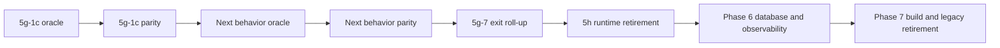

# ADempiere modernization completion forecast

> **Forecast snapshot:** `develop` at
> `c6e7acfed1887ab9c9160a8baa3e619569c4ee70` (2026-09-09).
>
> **Forecast date:** 2026-09-14.
>
> **Scope:** Completion of the repository roadmap through Phase 7 in
> [`MODERNIZATION_PLAN.md`](../../MODERNIZATION_PLAN.md). Customer-specific
> production rollout is not included.
>
> **Measured baseline:** The historical effort audit ends at PR #30 on
> 2026-09-05. PR #31 added that audit and is not included in its usage totals.

## Executive answer

The current effort got far enough to prove the modernization architecture, not
far enough to finish the product-wide migration. Phases 1-4 are complete.
Phase 5 has a reproducible Jakarta web runtime, fail-closed routing, migrated
route foundations, an independently frozen legacy write oracle, one accepted
modern Business Partner write flow, and a portable clean-download demo. That is
a substantial risk-retirement milestone: the approach works end to end.

It is not a broad UI or production-readiness claim. Ten Phase 5g behavior
packages remain, followed by the Phase 5h runtime cutover, the Phase 6 database
and observability work, and the Phase 7 build and legacy retirement work. Every
remaining Phase 5g behavior class needs a separately captured, reviewed, and
merged legacy oracle before its modern parity work can start
([Phase 5g ADR](phase-5g-web-parity-adr.md)).

| Forecast | Low | Base | High |
|---|---:|---:|---:|
| Likely remaining PRs | 37 | **74** | 125 |
| Remaining Copilot credits | 348,000 | **646,000** | 1,116,000 |
| AI-driven wall time at the original observed cadence | 7.8 weeks | **14.5 weeks** | 25.1 weeks |
| Active model-execution time, lower bound | 4.4 days | **8.2 days** | 14.2 days |
| Solo maintainer + Copilot planning calendar | 23 weeks | **46 weeks** | 92 weeks |
| Solo two-week sprints | 12 | **23** | 46 |
| Three-person team planning calendar | 16 weeks | **32 weeks** | 64 weeks |
| Three-person team two-week sprints | 8 | **16** | 32 |
| Cost-weighted roadmap complete | 23% | **14%** | 8% |

If "using AI" means the same delivery model used for the original effort -
Copilot performs the analysis, implementation, debugging, documentation, and CI
iteration while a human directs and approves the work - the base estimate is
**about 14.5 weeks, or 3.5 months, of similarly concentrated AI-driven
delivery**. The low/high range is 7.8-25.1 weeks.

The separate 46-week base is a conservative planning calendar that adds ordinary
availability, domain-review and stakeholder latency, and wider uncertainty for
Phases 5h-7. A small team improves that planning calendar to about 32 weeks,
not 14.5 weeks, because oracle-before-modern, merge-before-next, and Phase 5 ->
Phase 6 -> Phase 7 create hard serialization.

These figures are a planning model, not a commitment. The strongest conclusion
is directional: **the accepted demo is closer to the end of the feasibility and
foundation work than to the end of the remaining implementation cost.**

## How far the programme actually got

Different progress measures answer different questions. No one measure should
be quoted alone.

| Lens | Current result | What it means |
|---|---|---|
| Top-level phases | **4 of 7 complete (57%)**; Phase 5 active | Correct for roadmap sequencing, but phases are not equal in cost. |
| Architecture and safety | Reproducible gates, JDK 21, installed product, modern SOAP, Jakarta web beachhead, legacy oracles, rollback paths, and CI topology are established | Most foundational uncertainty has been retired. Future behavior packages can reuse this infrastructure. |
| Functional modernization | One read/write Business Partner vertical slice is accepted and demoable | The pattern is proven, but Sales Order, accounting, general processes, reports, files, dashboards, extensions, POS, and full visual/performance parity remain. |
| Runtime retirement | Tomcat 9, ZK 3.6, the compatibility router, and the transformer are still required | Phase 5h cannot begin until Phase 5g and the disabled-context dispositions close. |
| Platform completion | PostgreSQL 16/observability and Gradle-only release production have not started | Phases 6 and 7 remain whole roadmap phases. |
| Cost-weighted progress | **8%-23%, base 14%** | Historical credits divided by historical plus forecast credits. This is the least flattering lens and the best warning against reading "4 of 7" as "more than half the cost is done." |

The cost-weighted percentage does not say the completed work was inefficient.
It says the remaining scope contains ten behavior families, their independent
oracles, the final dual-runtime removal, a database-major migration, and a
build/release authority cutover. The first accepted behavior family alone
required the oracle, two oracle amendments, modern parity, and routing
corrections.

## What is complete

The completed programme through the demo is measured in
[`modernization-effort-report.md`](modernization-effort-report.md) and its CSV
ledgers:

- 30 merged implementation and demo PRs;
- 102,587.72 accounted Copilot credits;
- 16 days 3 hours 48 minutes of programme calendar span;
- reproducible core tests and dependency verification;
- JDK 21 runtime and installed-product gates;
- XFire replacement with contract-preserving CXF/Jakarta SOAP;
- Jakarta/ZK CE 10 web runtime, cohort routing, session isolation, route
  ownership, and rollback;
- a frozen legacy Business Partner write answer;
- modern Business Partner create, update, stale-save refusal, duplicate-submit
  behavior, deactivation, workflow attribution, and session cleanup matching
  that answer;
- a clean-download, localhost-only demo bundle.

PR #31, which committed the historical audit, is outside those usage totals. It
is documentation work and is not silently treated as zero implementation cost.

## What remains

The machine-readable estimate is
[`modernization-completion-forecast.csv`](modernization-completion-forecast.csv).
The validator requires every open roadmap package to appear exactly once.

| Package | Remaining claim | Likely PRs low/base/high | Credits low/base/high | Solo weeks low/base/high | Confidence |
|---|---|---:|---:|---:|---|
| 5g-1c | Sales Order draft -> Complete, excluding accounting | 2 / 4 / 7 | 24k / 38k / 58k | 1 / 2 / 4 | Medium |
| 5g-1d | Explicit posting and balanced accounting facts | 3 / 5 / 8 | 30k / 48k / 72k | 1.5 / 2.5 / 5 | Medium-low |
| 5g-1e | Named non-report dictionary process | 2 / 4 / 6 | 18k / 30k / 46k | 0.75 / 1.5 / 3 | Medium |
| 5g-1f | Callout-bearing write parity | 2 / 5 / 9 | 24k / 42k / 70k | 1 / 2 / 4 | Medium-low |
| 5g-2 | Reports, viewers, PDF/print, and Jasper residuals | 3 / 6 / 10 | 28k / 50k / 85k | 1.5 / 3 / 6 | Low |
| 5g-3 | Upload/download, attachments, import, and viewers | 2 / 4 / 7 | 20k / 36k / 60k | 1 / 2 / 4 | Medium |
| 5g-4 | Dashboard and polling replacement for server push | 2 / 5 / 8 | 24k / 42k / 70k | 1 / 2.5 / 5 | Medium-low |
| 5g-5 | Extension and plugin parity | 3 / 7 / 12 | 30k / 60k / 110k | 2 / 4 / 8 | Low |
| 5g-6 | POS parity | 3 / 6 / 10 | 30k / 55k / 95k | 1.5 / 3.5 / 7 | Low |
| 5g-7 | Visual/performance/rollback/disposition/CI exit roll-up | 4 / 8 / 14 | 25k / 50k / 90k | 2 / 4 / 8 | Low |
| 5h | Final Jakarta ingress and legacy web runtime removal | 3 / 5 / 8 | 25k / 50k / 90k | 1.5 / 3 / 6 | Low |
| Phase 6 | PostgreSQL 16 migration and observability | 4 / 7 / 12 | 35k / 70k / 130k | 4 / 8 / 16 | Low |
| Phase 7 | Gradle-only release and evidence-based retirement | 4 / 8 / 14 | 35k / 75k / 140k | 4 / 8 / 16 | Low |

The **20 oracle/parity increments** implied by ten remaining Phase 5g rows are
only a floor. They are not the base estimate. `5g-7` is a multi-part exit
programme, `5g-1f` is informed by 174 callout columns, and `5g-5` is informed by
197 extension surfaces. The ledger therefore sizes each row separately.

`5g-1c-oracle` is named but has not been captured, reviewed, or merged. The
oracles for `5g-1d` through `5g-7` remain unassigned and blocking. Naming an
oracle is not equivalent to producing its accepted answer.

## Estimation method

### Historical calibration

The historical baseline is the first modernization session through the merge of
PR #30:

| Input | Value | Source |
|---|---:|---|
| Merged PRs | 30 | [`modernization-effort-by-pr.csv`](modernization-effort-by-pr.csv) |
| Accounted credits | 102,587.72 | Effort report plus the shared/unallocated reconciliation row |
| Calendar span | 16.158 days | [`modernization-effort-report.md`](modernization-effort-report.md) |
| Completed behavior-family analogue | Business Partner oracle, amendments, parity, and corrections | PRs #14, #16-#21 in the effort report |

The Business Partner behavior family cost approximately 42,500 credits when
the oracle, two amendments, modern parity, and routing corrections are counted
together. That is the best direct analogue for remaining Phase 5g work, but it
is not copied ten times unchanged:

- reusable infrastructure receives an explicit scenario discount;
- flow-specific capture, fixtures, domain review, and relational facts do not;
- oracle amendments and parity corrections are included in the base case
  because they occurred in the only completed example;
- broad rows such as extension parity, POS, and the exit roll-up receive wider
  bands.

PR count and credits are modeled independently. The historical distribution is
too uneven to infer one from the other: the nine demo PRs consumed only 1,465
credits, while individual oracle/parity PRs consumed more than 10,000 credits.

### AI-driven completion time

The original modernization was already an AI-driven implementation: Copilot
performed the repository work and the user supplied direction, review, and
approval. Extrapolating the forecast credits at the observed rate of
102,587.72 credits over 16.158 calendar days gives:

| Scenario | AI-driven wall time at the original observed cadence | Approximate duration |
|---|---:|---:|
| Low | 7.8 weeks | 1.8 months |
| Base | **14.5 weeks** | **3.5 months** |
| High | 25.1 weeks | 5.8 months |

This is the direct answer to "how long if we continue doing it with AI as we did
before?" It assumes the unusually concentrated original cadence is sustained,
including the human steering and CI iteration that were part of that observed
workflow.

The recorded active model-runtime duration provides a second, narrower measure:

| Scenario | Projected active model execution |
|---|---:|
| Low | 4.4 days |
| Base | **8.2 days** |
| High | 14.2 days |

Those are aggregate model-running days, not elapsed calendar time. They are
explicit lower bounds because the historical audit did not retain active
runtime for every recovered model call, concurrent calls are additive, and the
future model mix may differ. They must not be presented as "the roadmap will be
done in eight days."

A literally autonomous, no-human workflow is not estimated. The original work
was AI-executed but human-directed, and the roadmap requires domain review,
oracle acceptance, disabled-context decisions, database inputs, and retirement
approvals that the repository cannot authorize by itself.

### Conservative planning calendar

The conservative planning view compares the AI-driven cadence with package-level
calendar allowances:

| Scenario | AI-driven observed cadence | Conservative planning calendar |
|---|---:|---:|
| Low | 7.8 weeks | 22.75 weeks |
| Base | 14.5 weeks | 46 weeks |
| High | 25.1 weeks | 92 weeks |

The AI-driven column assumes the unusually concentrated demo-period intensity
continues. The conservative column allows for ordinary availability, separate
domain review, branch sequencing, CI queue/failure cycles, stakeholder
decisions, and the five-day no-merge tail between PR #31 and this forecast date.

The planning calendar is the sum of package-level low/base/high estimates in
the forecast ledger. It preserves the known serialization and widens
uncalibrated Phase 5h-7 work.

### Sprint interpretation

A "sprint" here means two calendar weeks, not measured labor capacity:

- **Solo maintainer + Copilot:** planning weeks divided by two.
- **Three-person team:** 70% of the solo calendar, then divided by two. The
  factor assumes parallel work on fixtures, validators, documentation, and
  independent preparation while preserving oracle/parity and phase-order
  serialization.

The sprint estimate is the lowest-confidence output. The repository has no
measured human labor ledger, and active AI execution time is not labor time.

## Reuse sensitivity

The base package estimates assume roughly 25%-50% effective reuse across the
remaining Phase 5g work. Reuse applies to the shared browser flow, scorer,
database restoration, routing, evidence validator patterns, and CI topology.
It does not eliminate behavior-specific oracle capture, domain review, fixtures,
or the product defects that parity exposes.

Holding scope and Phases 5h-7 constant, a 20-point change in effective Phase 5g
reuse moves the base forecast by roughly 80,000 credits:

| Effective reuse sensitivity | Remaining credits |
|---|---:|
| 20 points below base | ~726,000 |
| Encoded base assumptions | **646,000** |
| 20 points above base | ~566,000 |

This is a one-way sensitivity check, not a replacement for the low/base/high
scope scenarios.

## Dependencies that control the calendar



The diagram is intentionally serial. Preparatory work can overlap, but an oracle
must be accepted before its parity implementation can be scored; each phase
branch merges to `develop` before the next begins; and Phases 6 and 7 depend on
the completed Phase 5 runtime topology.

## Confidence and primary risks

| Area | Confidence | Reason |
|---|---|---|
| 5g-1c through 5g-1f | Medium to medium-low | The Business Partner sequence is a strong analogue and the shared harness exists, but each behavior creates new relational and UI facts. |
| Reports, extensions, POS, and 5g exit | Low | Scope breadth and production ownership are not established by the checkout. |
| Phase 5h | Low | No completed increment has removed the full compatibility topology after a long coexistence period. |
| Phase 6 | Low | Disposable database gates exist, but durable PostgreSQL-major migration and rollback evidence do not. |
| Phase 7 | Low | Build reproducibility exists, but complete Ant/Gradle release parity and removal have no completed analogue. |

The largest forecast drivers are:

1. how many distinct oracles the broad Phase 5g rows require;
2. amendment and correction frequency;
3. whether `/mobile`, `/adempiere`, and `/admin` migrate, retire, or narrow
   Phase 5h;
4. production ownership decisions for extensions and POS;
5. availability of a sanitized production-like database for Phase 6;
6. artifact differences uncovered during Phase 7 parallel build comparison.

## Explicit exclusions

This forecast ends when the repository's Phase 7 exit criteria are met. It does
not estimate:

- a customer production deployment;
- customer-specific extension and overlay remediation;
- production database size-dependent migration windows;
- identity-provider, networking, HA, backup, disaster-recovery, or support
  adoption;
- user training, change management, or contractual certification.

Those are follow-on implementation programmes, not hidden work inside this
repository estimate.

## Recalculation

After each merged roadmap increment:

1. move the completed package out of
   [`modernization-completion-forecast.csv`](modernization-completion-forecast.csv);
2. replace assumptions with measured PR, credit, and calendar evidence;
3. split any newly discovered broad package rather than burying it in
   contingency;
4. run:

   ```bash
   python3 scripts/modernization/validate-modernization-completion-forecast.py
   ```

5. update this report's rollups and the current-status pointer in
   [`MODERNIZATION_PLAN.md`](../../MODERNIZATION_PLAN.md).

The plan remains authoritative for scope, order, gates, and acceptance criteria.
This document and its CSV are authoritative only for the completion forecast.
